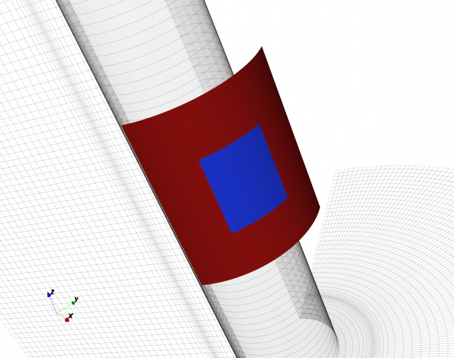
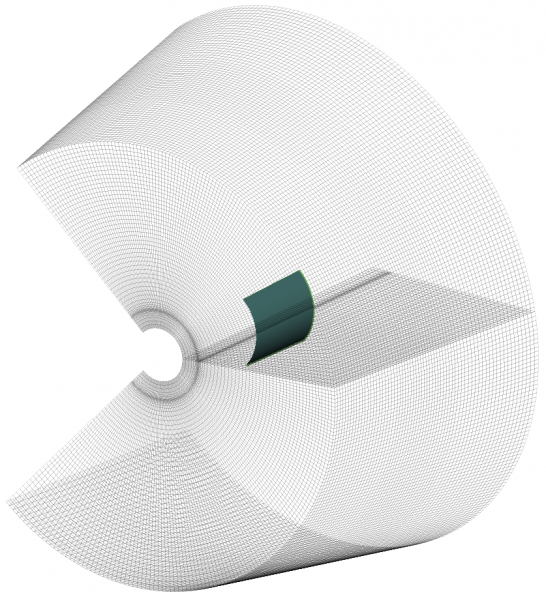
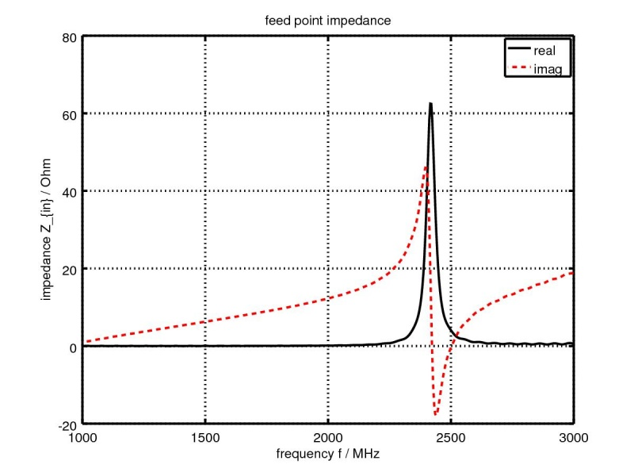
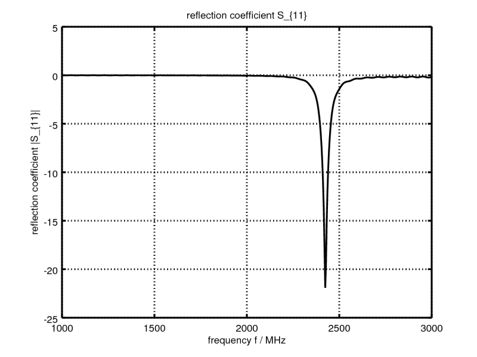
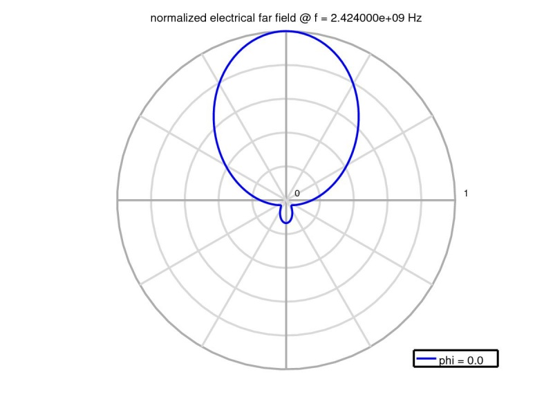
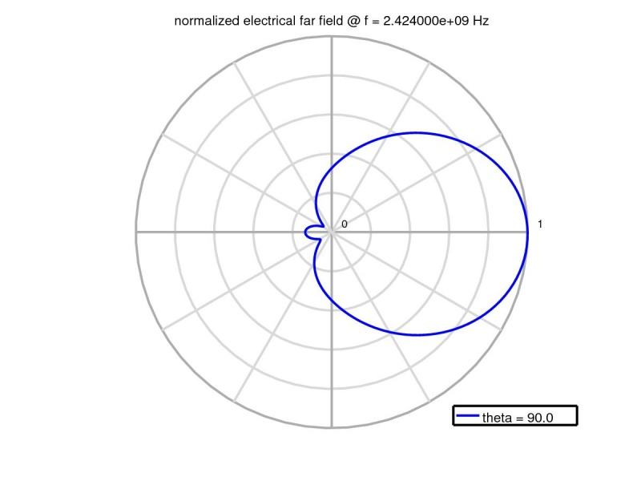
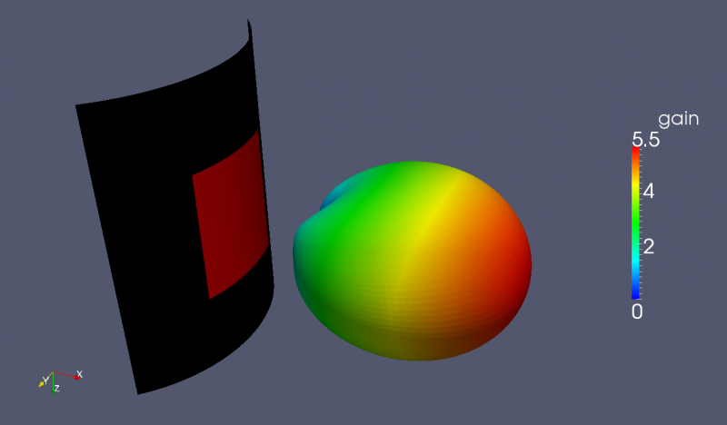

.. _octave_tutorial_bent_patch:

Bent Patch Antenna
==================

Simulate a microstrip patch antenna wrapped around a curved substrate and
extract its S-parameters and radiation pattern. This is the cylindrical
counterpart to the :ref:`Simple Patch Antenna <octave_tutorial_simple_patch>`
— the geometry and meshing approach are analogous, but everything is expressed
in cylindrical coordinates (r, azimuth, z).

**This tutorial covers:**

* Cylindrical coordinate system (``CoordSystem=1``) for conformal antenna modelling
* Using ``AddBox`` in cylindrical coordinates — start/stop are (radius, azimuth, z)
* C-shaped simulation domain (±135° in azimuth) to reduce cell count
* Surface current dump for mode visualization at resonance
* Far-field calculation with :func:`CalcNF2FF` in cylindrical coordinates

Octave/Matlab Script
--------------------

.. include:: ./__Bent_Patch_Antenna.txt

Images
------

    3D view of the bent patch antenna on curved substrate (AppCSXCAD)

    Cylindrical mesh — C-shaped domain spanning ±135° in azimuth

    Feed-point impedance (real and imaginary parts)

    Reflection coefficient S11 over frequency

    Far-field radiation pattern at phi = 0°

    Far-field radiation pattern at theta = 90°

    3D farfield radiation pattern
