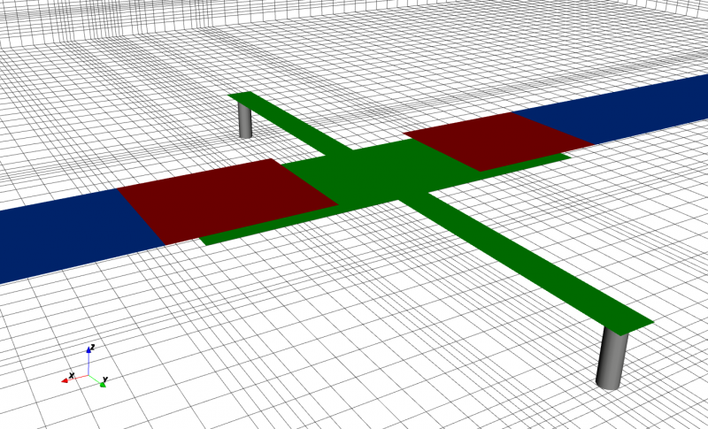
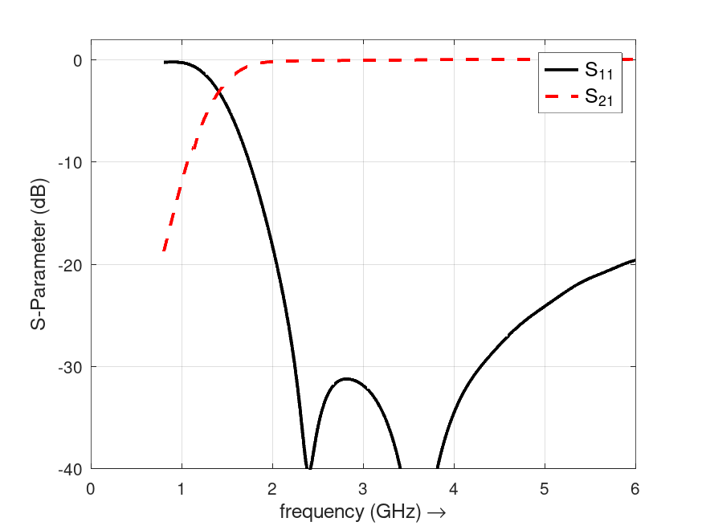
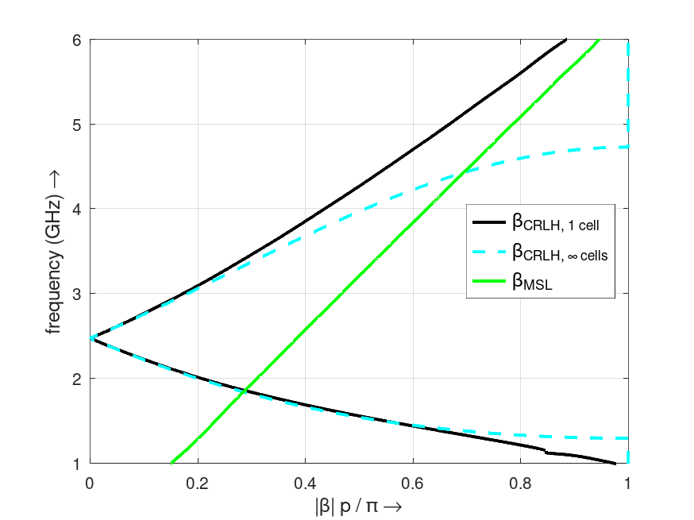

.. _octave_tutorial_crlh_extraction:

CRLH Parameter Extraction
==========================

Extract the equivalent-circuit parameters (L_R, C_R, L_L, C_L) of a
Composite Right/Left-Handed (CRLH) unit cell from FDTD S-parameter
simulation using the Bloch-wave dispersion relation.

**This tutorial covers:**

* CRLH unit cell geometry (interdigital capacitor and shunt stub)
* Bloch-wave dispersion parameter extraction from S11/S21
* Comparison of extracted vs. target CRLH parameters
* Building a CRLH structure via the ``CreateCRLH`` helper function

Octave/Matlab Script
--------------------

.. include:: ./__CRLH_Extraction.txt

Images
------

    CRLH unit cell with interdigital capacitor and shunt stub (AppCSXCAD)

    S-parameters of the CRLH unit cell

    Bloch-wave dispersion diagram showing the left- and right-handed bands

Notes
-----

* See the :ref:`MSL Notch Filter <octave_tutorial_msl_notchfilter>` tutorial
  for an introduction to microstrip line ports and the 1/3–2/3 mesh rule
  used in ``CreateCRLH``.
* The extracted unit cell can be used directly in the
  :ref:`CRLH Leaky Wave Antenna <octave_tutorial_crlh_leaky_wave>` tutorial.
