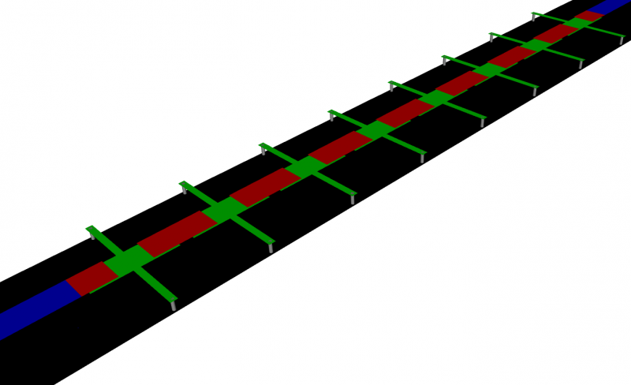
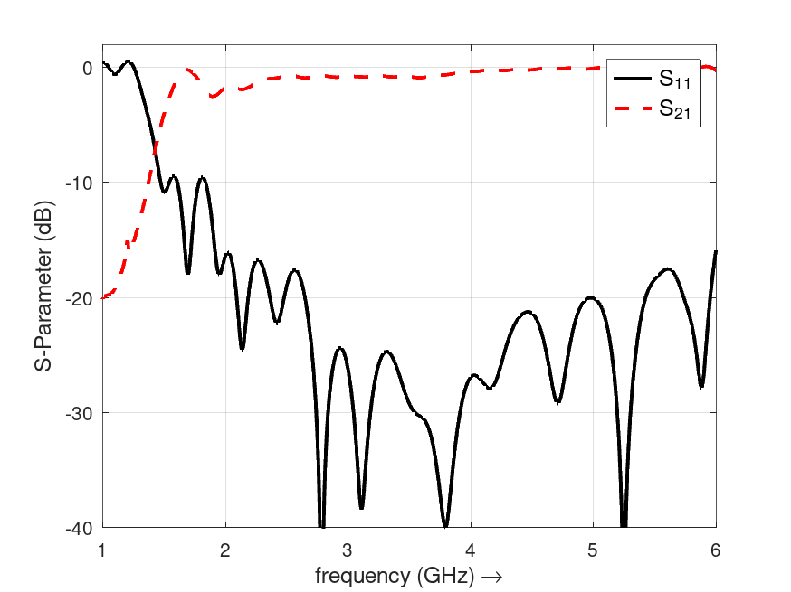
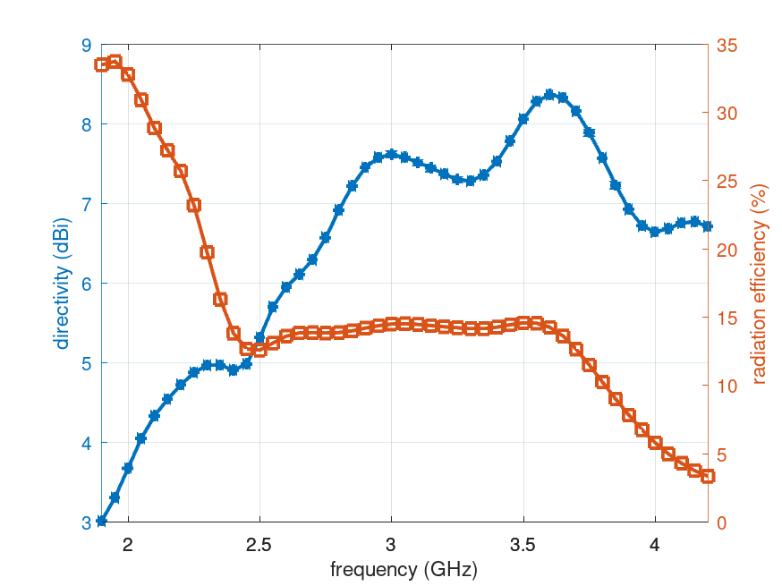
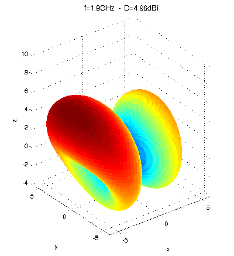

.. _octave_tutorial_crlh_leaky_wave:

CRLH Leaky Wave Antenna
========================

Simulate a CRLH transmission-line leaky-wave antenna and demonstrate
the frequency-controlled beam-scanning property including broadside radiation.

**This tutorial covers:**

* Multi-cell CRLH structure construction
* Leaky-wave radiation and beam-angle vs. frequency
* Far-field pattern extraction and beam-scanning visualization

Octave/Matlab Script
--------------------

.. include:: ./__CRLH_LeakyWaveAnt.txt

Images
------

    CRLH leaky wave antenna geometry (AppCSXCAD)

    S-parameters showing the passband and beam-scanning behavior

    Directivity and radiation efficiency over frequency

    Beam scanning across frequency — 3D far-field pattern animation

Notes
-----

* The CRLH unit cell geometry and parameter extraction are covered in the
  :ref:`CRLH Parameter Extraction <octave_tutorial_crlh_extraction>` tutorial,
  which should be run first.
* **Runtime warning:** the full 3D radiation pattern sweep (``Plot_3D_Rad_Pattern = 1``)
  can take up to 7 hours. It is disabled by default (``Plot_3D_Rad_Pattern = 0``);
  enable it only when you need the complete angular coverage.
