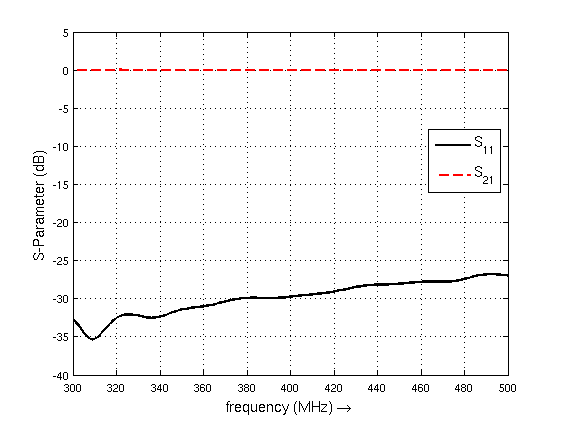
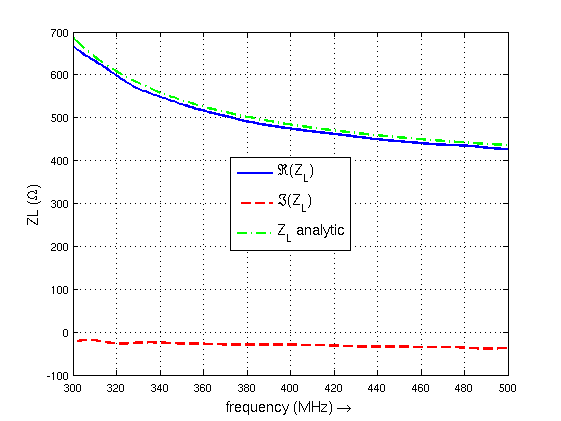

.. _octave_tutorial_circ_waveguide:

Circular Waveguide
==================

Simulate the dominant TE11 mode in a circular metallic waveguide and verify
the cut-off frequency against the analytical solution.

**This tutorial covers:**

* Cylindrical coordinate system for circular cross-sections
* Mode-matched circular waveguide port setup
* Cut-off frequency extraction and comparison with theory

Octave/Matlab Script
--------------------

.. include:: ./__Circ_Waveguide.txt

Images
------

    S-parameters of the circular waveguide showing TE11 cut-off

    Simulated wave impedance vs. analytic TE11 result

Notes
-----

This tutorial is the cylindrical-coordinate counterpart to the
:ref:`Rectangular Waveguide <octave_tutorial_rect_waveguide>` tutorial —
the port setup, post-processing, and result interpretation are nearly
identical. The ``calcPort`` field variable naming (``uf``/``if``,
``inc``/``ref``/``tot``) is explained there.

Suggested Modifications
-----------------------

* Try exciting and detecting different or multiple modes simultaneously.
* Add an asymmetric dielectric load inside the waveguide to observe
  mode conversion (requires multi-mode port detection).
* Insert a periodic dielectric grating to produce frequency-selective
  Bragg reflections.
