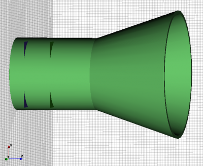
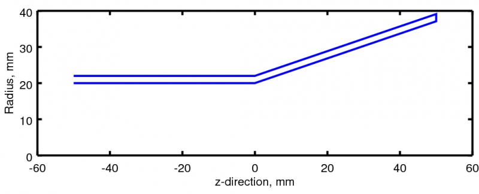
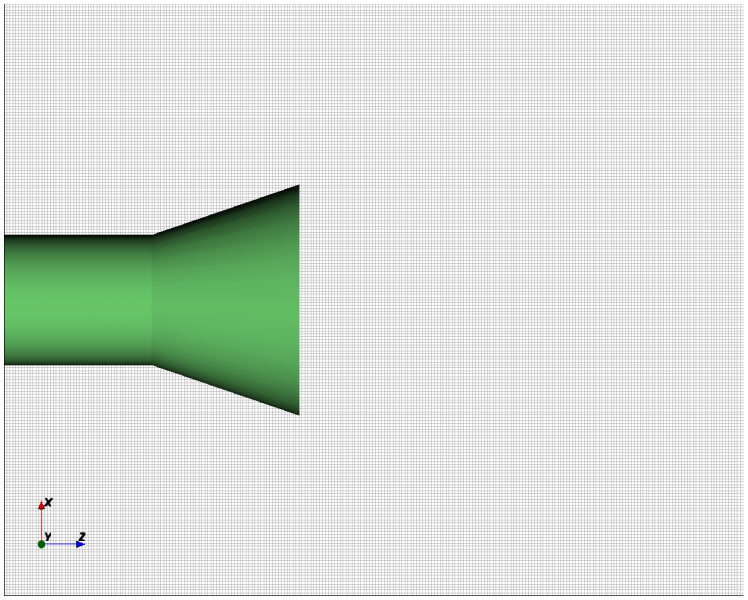
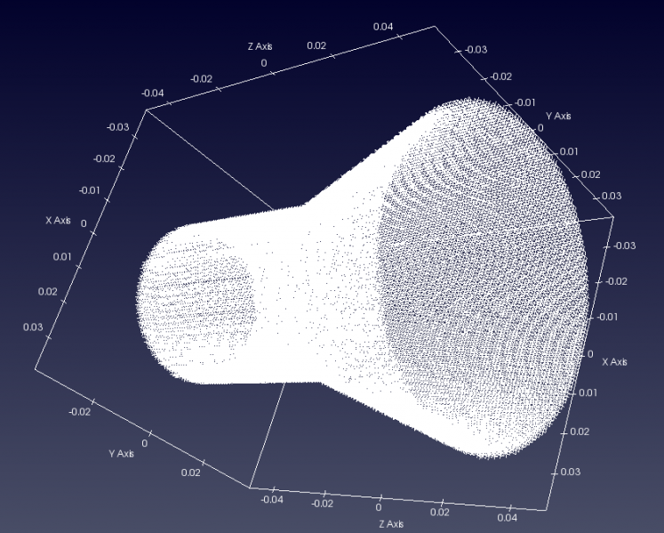
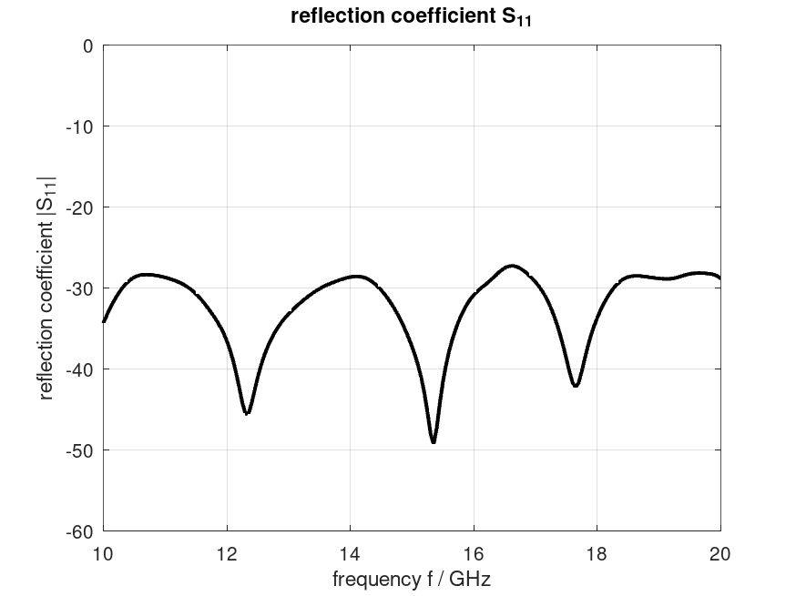
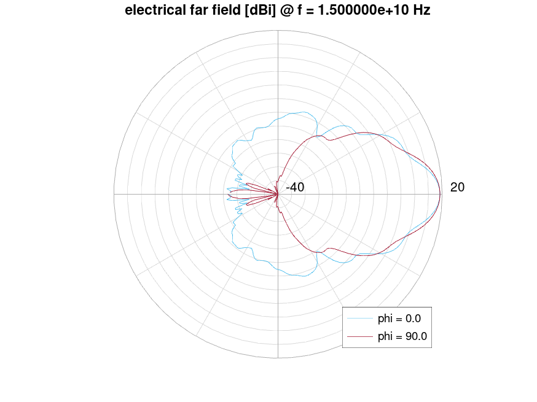
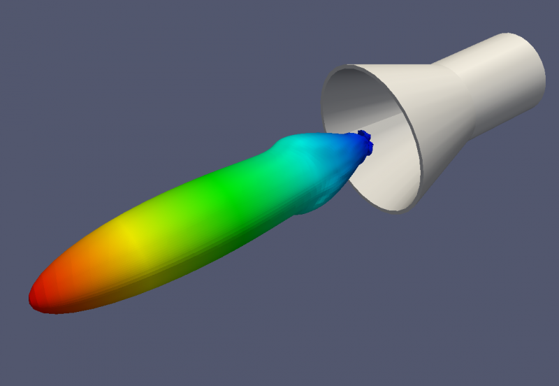

.. _octave_tutorial_conical_horn:

Conical Horn Antenna
====================

Simulate a conical horn antenna fed by a circular waveguide, compute its
S-parameters and far-field radiation pattern, and evaluate aperture efficiency.

**This tutorial covers:**

* Conical horn geometry via ``AddRotPoly`` (rotational polygon) on a
  **Cartesian** grid — even though the horn is rotationally symmetric, openEMS
  uses a rectangular mesh throughout; the circular profile is approximated by
  the rotational polygon
* Circular waveguide port (``AddCircWaveGuidePort``, TE11 mode) with
  ``horn.radius`` set to the circular waveguide (feed) radius
* Simulation time: < 10 min; far-field calculations: ~1 hour
* Note: the z-mesh does not extend to ``-SimBox/2`` but starts at
  ``-horn.feed_length`` — the mesh only covers the actual structure

Octave/Matlab Script
--------------------

.. include:: ./__Conical_Horn_Antenna.txt

Images
------

    Conical horn geometry with circular waveguide feed (AppCSXCAD)

    Cross-section showing the rotational polygon that defines the horn wall

    Cartesian mesh in the x-z plane — note the mesh starts at
    ``-horn.feed_length`` in z, not at the SimBox boundary

    Mesh detail near the aperture edge

    Reflection coefficient S11 over frequency

    2D polar far-field pattern at 15 GHz

    3D far-field radiation pattern of the conical horn antenna
