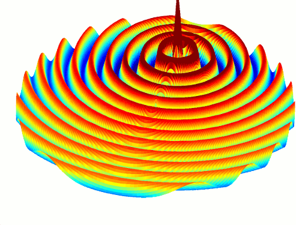

.. _octave_tutorial_cylindrical_wave:

2D Cylindrical Wave
===================

Simulate a 2D cylindrical wave radiating from an off-centre point source,
using five nested cylindrical sub-grids to prevent azimuthal over-sampling
near the axis while keeping the domain large enough to observe far-field
behaviour.

**This tutorial covers:**

* Cylindrical coordinate system (``CoordSystem=1``) in openEMS
* Nested cylindrical sub-grids (``MultiGrid``) that double azimuthal
  resolution at each boundary towards the axis
* Combined VTK (time-domain) and HDF5 (frequency-domain) field dumps
* Phase animation of the complex E_z phasor in Octave

Octave/Matlab Script
--------------------

.. include:: ./__CylindricalWave_CC.txt

Notes
-----

**Sub-grid azimuthal resolution:** the outermost sub-domain carries
50 × 2\ :sup:`5` = 1600 azimuthal lines; each inner sub-grid halves this
count, so the angular cell size scales with radius and avoids the extreme
over-sampling that a uniform mesh would produce near the axis.

**AppCSXCAD limitation:** ``CSXGeomPlot`` does not render the sub-grid
structure — it displays the finest azimuthal mesh at all radii instead.
The actual multi-resolution grid only becomes visible in the field-dump output.

Images
------

    Phase animation of the E_z field showing the asymmetric cylindrical wave
    propagating outward from the off-centre source
