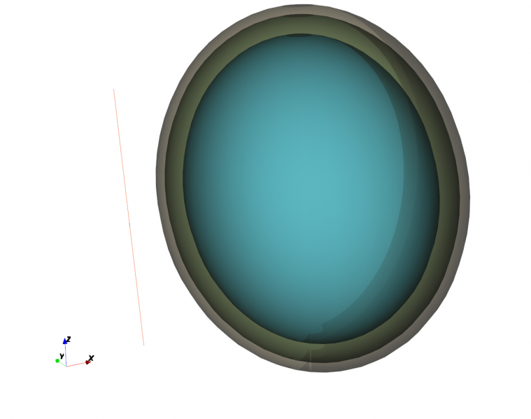
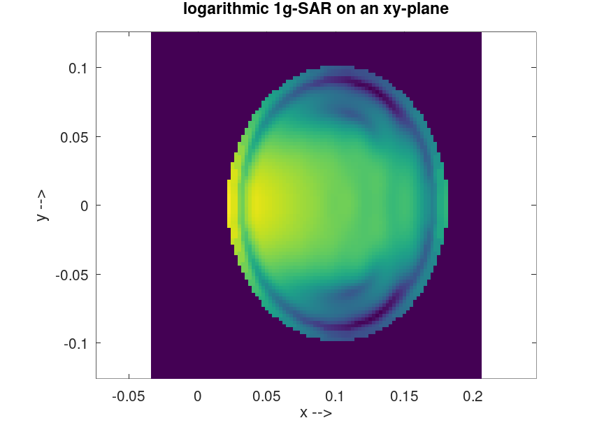
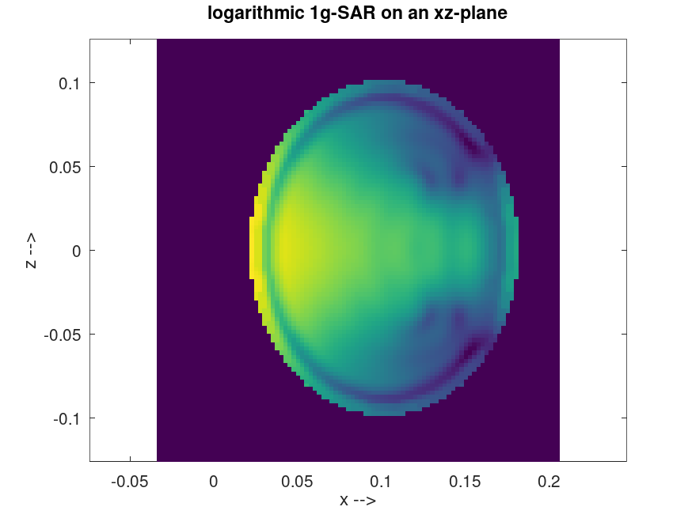

.. _octave_tutorial_dipole_sar:

Dipole SAR
==========

Simulate a half-wave dipole next to a multi-layer tissue phantom and compute
the Specific Absorption Rate (SAR) distribution using the built-in SAR
processing.

**This tutorial covers:**

* Multi-layer (stacked) biological tissue phantom with individual conductivity and mass density per layer
* Ellipsoidal phantom geometry via :func:`AddSphere` with ``Transform``/``Scale``
* SAR computation via :func:`AddDump` with ``DumpType`` 29 (frequency-domain power-loss density → spatially averaged SAR)
* NF2FF surface for radiated power budget: total accepted power ≈ Prad + SAR-absorbed power (self-consistency check)
* S-parameter and feed-point impedance extraction alongside the SAR distribution
* Visualization of logarithmic SAR distributions on cross-sectional planes

Octave/Matlab Script
--------------------

.. include:: ./__Dipole_SAR.txt

Images
------

    Half-wave dipole positioned next to the layered head phantom (AppCSXCAD)

    averaged SAR distribution in the xy-plane

    averaged SAR distribution in the xz-plane
