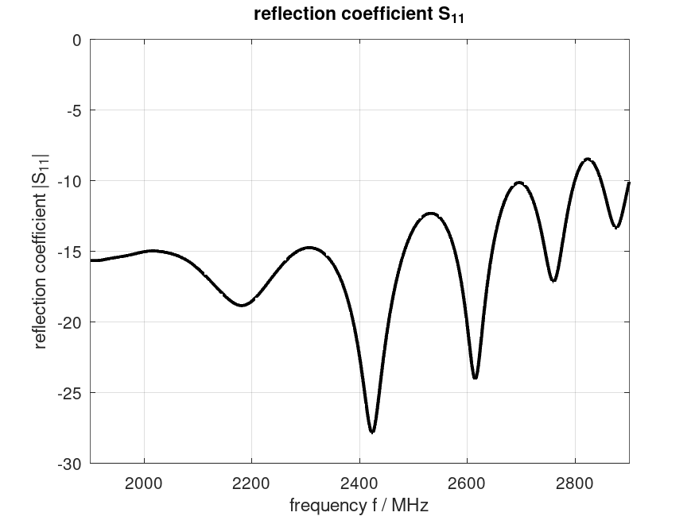
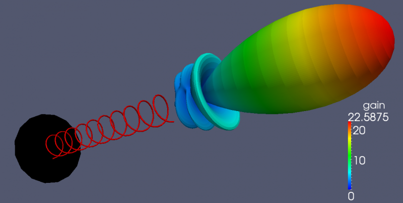

.. _octave_tutorial_helical_antenna:

Helical Antenna
===============

Design and simulate an axial-mode helical antenna, demonstrating end-fire
radiation and circular polarization via near-field to far-field transformation.

**This tutorial covers:**

* Helix geometry using the wire (curve) primitive :func:`AddCurve` — sub-cell accuracy on a Cartesian mesh
* Lumped port feeding with 120 Ω source resistance matching the natural axial-mode helix impedance
* NF2FF box with ``OptResolution`` field subsampling for efficiency
* S-parameter and feed-point input impedance extraction
* Circular polarization analysis (CPRH/CPLH components) and directivity via :func:`CalcNF2FF`

Octave/Matlab Script
--------------------

.. include:: ./__Helical_Antenna.txt

Images
------

    Reflection coefficient S11 over frequency

    Far-field pattern showing end-fire radiation and circular polarization
