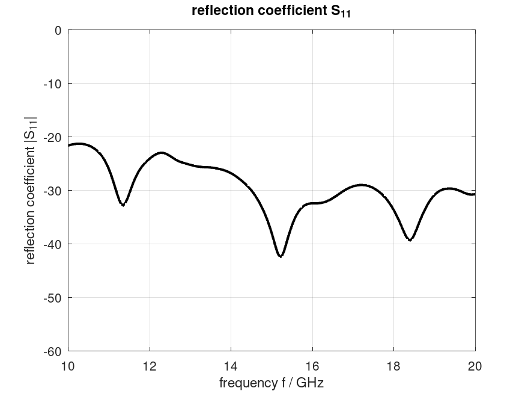
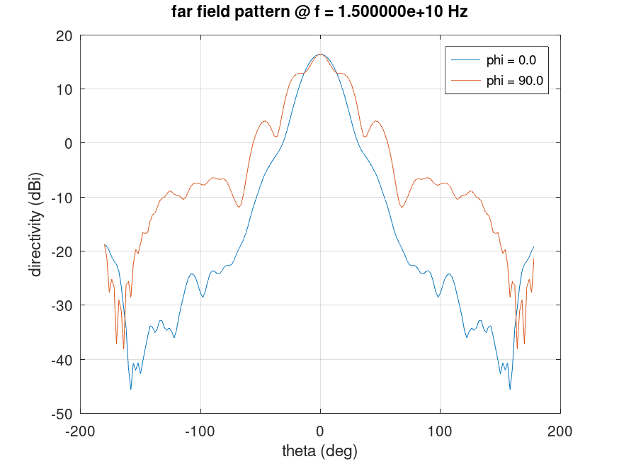
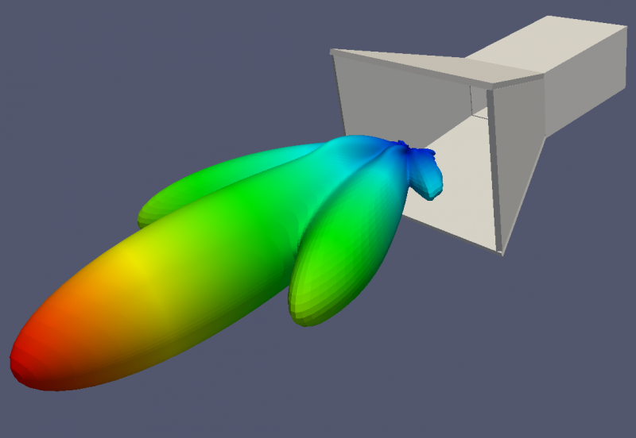

.. _octave_tutorial_horn_antenna:

Horn Antenna
============

Simulate a pyramidal horn antenna fed by a rectangular waveguide, compute
gain and directivity, and verify against analytical estimates.

**This tutorial covers:**

* Rectangular waveguide port using :func:`AddRectWaveGuidePort`
* Horn aperture geometry with PEC walls
* Far-field gain and directivity via NF2FF
* Comparison with aperture-theory predictions

Octave/Matlab Script
--------------------

.. include:: ./__Horn_Antenna.txt

Images
------

    Reflection coefficient S11 over frequency

    2D Far-field radiation pattern of the pyramidal horn antenna

    Far-field radiation pattern of the pyramidal horn antenna
