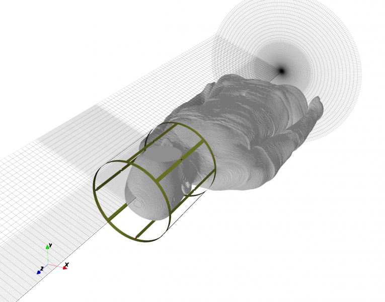
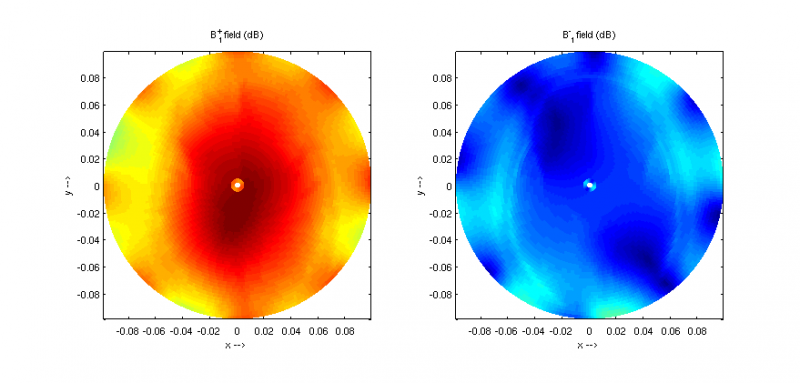
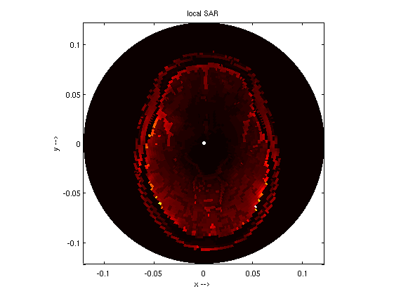
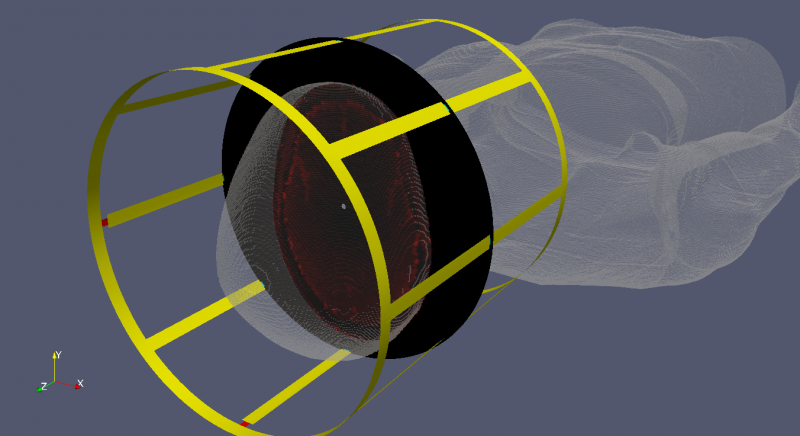

.. _octave_tutorial_mri_lp_birdcage:

MRI Linear Polarized Birdcage Coil
====================================

Simulate a linear-polarized birdcage coil for MRI at 297 MHz (7 T), tune
the resonance with distributed capacitors, and evaluate B1 field homogeneity.

**This tutorial covers:**

* Birdcage coil geometry with multiple rungs and end rings
* Distributed lumped capacitors for resonance tuning
* B1 field homogeneity assessment across the coil bore

Octave/Matlab Script
--------------------

.. include:: ./__MRI_LP_Birdcage.txt

Images
------

    3D view of the linear-polarized birdcage coil (AppCSXCAD)

    B1 field distribution inside the coil bore

    SAR distribution in the phantom

    3D SAR distribution

Body Model
----------

This tutorial uses the **Ella** voxel body model from the IT'IS Virtual
Family dataset (``Ella_26y_V2_1mm``). The dataset is free for academic and
non-commercial use but requires registration and a license agreement from the
IT'IS Foundation (https://itis.swiss/virtual-population/).

Once downloaded, the raw files are converted to an openEMS HDF5 DiscMaterial
file by ``Convert_VF_DiscMaterial`` (run once, result is cached).

**Automatic phantom fallback:**

If the VF dataset is not installed, the script falls back automatically to
the bundled ``resources/phantoms/phantom_body_128MHz.h5`` — a 3-layer
cylindrical body phantom (skin / bone / tissue, radius 100 mm) with tissue
properties at 128 MHz from the IT'IS database, shared with the Python
interface. The cylindrical FDTD solver converts each cell-centre position
from cylindrical to Cartesian before the disc-material lookup, so the
Cartesian phantom mesh is sampled correctly. The full B1 and SAR workflow
runs without any changes.

Literature
----------

* A. Christ et al., "The Virtual Family — Development of surface-based
  anatomical models of two adults and two children for dosimetric simulations,"
  *Phys. Med. Biol.*, vol. 55, 2010.
