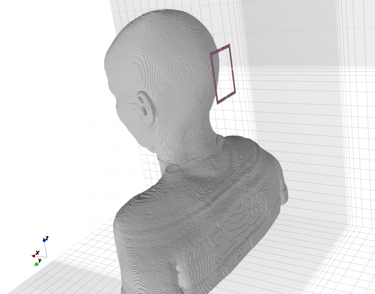
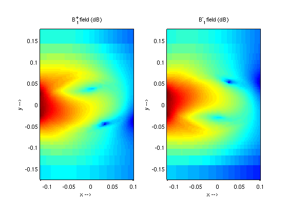
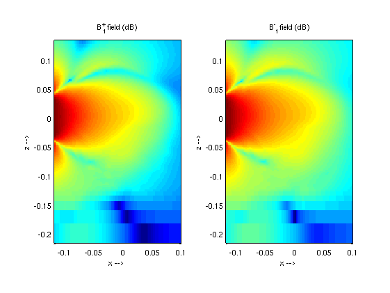
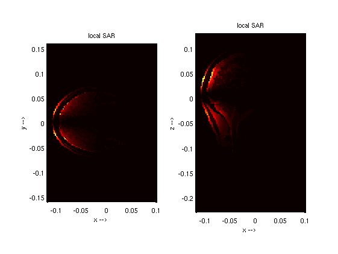
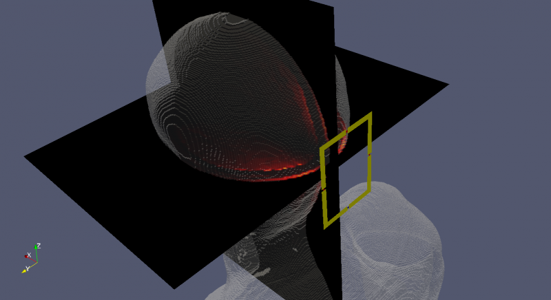

.. _octave_tutorial_mri_loop_coil:

MRI Loop Coil
=============

Simulate a single-loop MRI receive coil at 297 MHz (7 T), compute the
B1 field distribution, and evaluate the coil's sensitivity and coupling.

**This tutorial covers:**

* Circular loop coil geometry with lumped capacitors for resonance tuning
* Lumped port excitation and S11 minimization
* B1 field dump and sensitivity mapping in the coil plane

Octave/Matlab Script
--------------------

.. include:: ./__MRI_Loop_Coil.txt

Images
------

    Loop coil geometry with lumped capacitors (AppCSXCAD)

    B1 field distribution in the xy-plane (coil plane)

    B1 field distribution in the xz-plane

    SAR distribution in the phantom

    3D SAR distribution

Body Model
----------

This tutorial requires the **Ella** voxel body model from the IT'IS Virtual
Family dataset (``Ella_26y_V2_1mm``). The dataset is free for academic and
non-commercial use but requires registration and a license agreement from the
IT'IS Foundation (https://itis.swiss/virtual-population/).

Once downloaded, the raw files are converted to an openEMS HDF5 DiscMaterial
file by ``Convert_VF_DiscMaterial`` (run once, result is cached).

**Alternative — homogeneous phantom:**

If you do not have access to the Virtual Family dataset, replace the
``Convert_VF_DiscMaterial`` call and the ``AddDiscMaterial`` box with a simple
ellipsoidal head phantom::

    CSX = AddMaterial(CSX, 'phantom_head');
    CSX = SetMaterialProperty(CSX, 'phantom_head', 'Epsilon', 60, 'Kappa', 0.7, 'Density', 1040);
    CSX = AddSphere(CSX, 'phantom_head', 0, [0 0 0], 110, 'Transform', {'Scale', [1 0.8 1]});

The material properties (εr = 60, σ = 0.7 S/m) approximate average head tissue
at 297 MHz and are sufficient to demonstrate the B1 and SAR workflow.

Literature
----------

* A. Christ et al., "The Virtual Family — Development of surface-based
  anatomical models of two adults and two children for dosimetric simulations,"
  *Phys. Med. Biol.*, vol. 55, 2010.
