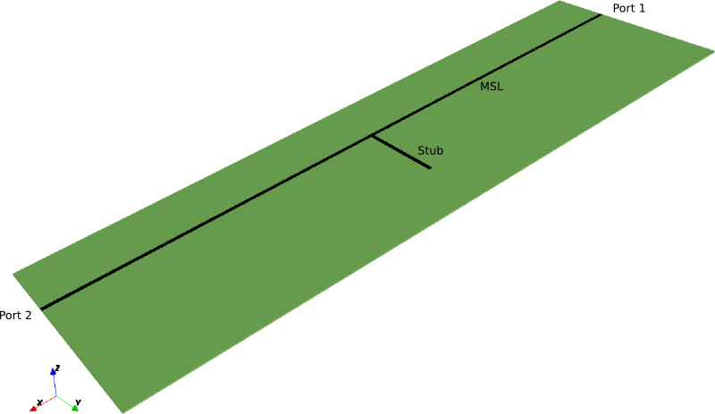
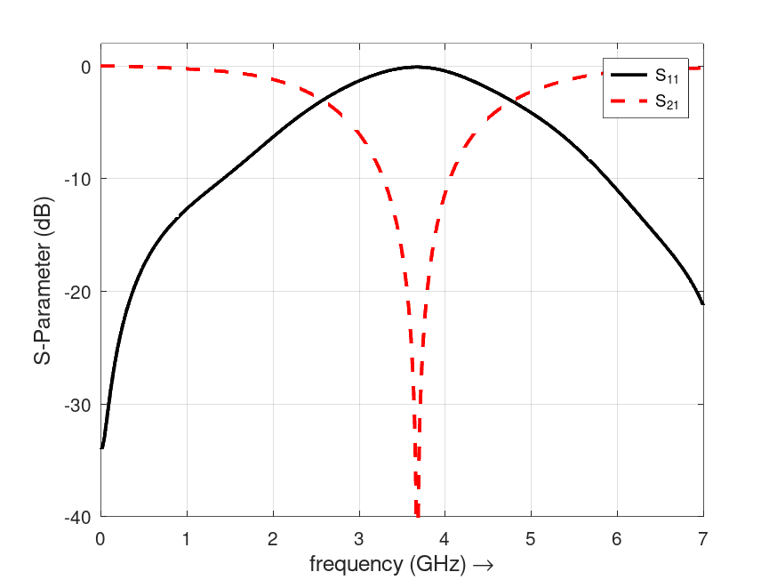
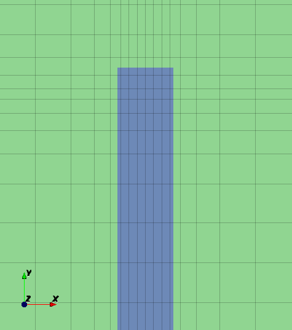
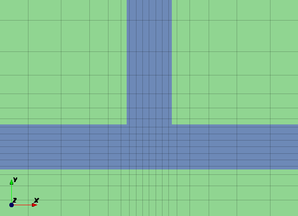
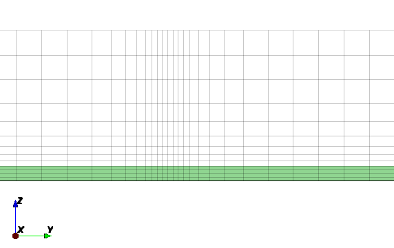

.. _octave_tutorial_msl_notchfilter:

Microstrip Notch Filter
=======================

A microstrip line (MSL) with an open-ended stub acting as a simple band-stop filter.

**This tutorial covers:**

* Setting up a microstrip line and MSL ports
* Applying an inhomogeneous mesh for improved accuracy
* Computing S-parameters and identifying the notch frequency

Octave/Matlab Script
--------------------

.. include:: ./__MSL_NotchFilter.txt

Images
------

    Microstrip notch filter geometry — open-ended stub on a microstrip line

    S-parameters showing the notch at the stub resonance frequency

Discussion
----------

This tutorial deliberately mis-aligns the mesh with the edges of the microstrip
conductor, using the **1/3 : 2/3 rule**: the two mesh lines bracketing each
conductor edge are placed one-third and two-thirds of a cell width apart rather
than exactly on the edge. This compensates for the surface-current singularity at
strip edges — the edge cells effectively capture the current concentration without
requiring very small grid cells that would greatly increase the number of time steps.

    Mesh at end of stub — mesh lines deliberately offset from conductor edges

    Mesh at T-junction — 1/3 : 2/3 offset applied at the stub branch point

    Mesh in the vertical (z) direction across the substrate stack

The accuracy benefit is demonstrated by comparing three mesh strategies on a plain
MSL without stub (theoretical :math:`Z_c` = 47.6 Ω from Transcalc):

.. list-table::
   :header-rows: 1
   :widths: 40 20 20

   * - Mesh type
     - :math:`Z_c` (Ω)
     - Cells
   * - Thirds (1/3 : 2/3)
     - 47.8
     - 167 k
   * - Uniform, aligned to edges
     - 44.0
     - 161 k
   * - Variable (fine near edges)
     - 45.5
     - 192 k

The thirds mesh is both more accurate *and* cheaper than the variable mesh.
The offset ratio is not critical; values between 0.25 and 0.4 all give acceptable
results:

.. list-table::
   :header-rows: 1
   :widths: 40 20 20

   * - Ratio
     - :math:`Z_c` (Ω)
     - Cells
   * - 1/3 : 2/3
     - 47.8
     - 167 k
   * - 0.4 : 0.6
     - 48.6
     - 167 k
   * - 1/4 : 3/4
     - 45.5
     - 167 k

The accuracy of the edge-current correction also depends on the substrate
permittivity — higher :math:`\varepsilon_r` concentrates fields more strongly,
increasing the cell count needed for a given accuracy:

.. list-table::
   :header-rows: 1
   :widths: 20 25 25 20

   * - :math:`\varepsilon_r`
     - :math:`Z_c` sim (Ω)
     - :math:`Z_c` theory (Ω)
     - Cells
   * - 1
     - 76.3
     - 80.7
     - 65 k
   * - 3.66
     - 47.8
     - 47.6
     - 167 k
   * - 10
     - 29.3
     - 29.9
     - 493 k

**References**

* W. Heinrich et al., "Optimum mesh grading for finite-difference method,"
  *IEEE Trans. MTT*, vol. 44, no. 9, pp. 1569–1574, Sep 1996.
* J. H. Oates, R. T. Shin, "Analytical Evaluation of Finite-Difference
  Time-Domain Transmission Line Properties,"
  *Progress In Electromagnetics Research*, PIER 16, pp. 87–115, 1997.
* A. Rennings, "Computational Electromagnetics — EC-FDTD," lecture notes,
  University of Duisburg-Essen.
