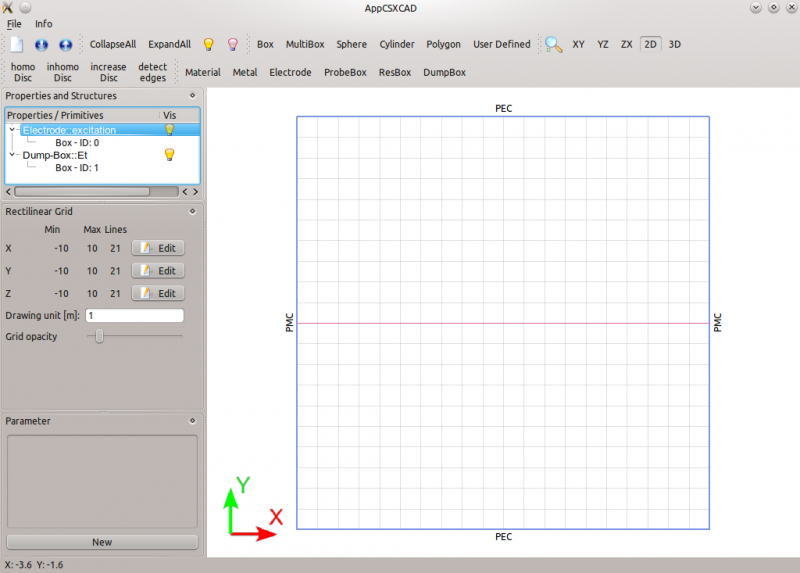
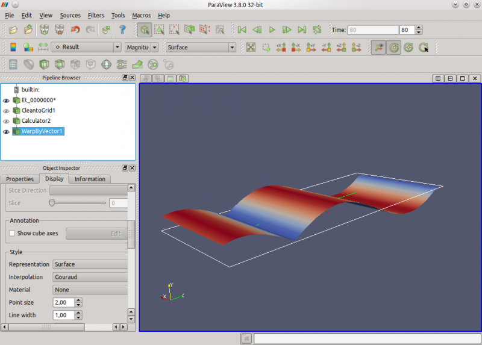

.. _octave_tutorial_parallel_plate_wg:

Parallel Plate Waveguide
========================

The simplest possible openEMS simulation: a parallel-plate waveguide excited
with a sinusoidal TEM mode, demonstrating the core workflow of geometry setup,
field dump, and result visualization.

**This tutorial covers:**

* FDTD setup with sinusoidal excitation and mixed boundary conditions
* Geometry and field-dump definition using CSXCAD
* Geometry inspection with AppCSXCAD
* Time-domain E-field animation in Paraview

Octave/Matlab Script
--------------------

.. include:: ./__Parallel_Plate_Waveguide.txt

Inspecting the Geometry
-----------------------

After running ``CSXGeomPlot``, AppCSXCAD opens and shows the simulation domain
in the xy-plane. The excitation box appears in blue covering the full
cross-section; the E-field dump plane (xz mid-plane at y = 0) appears as a
red line.

    AppCSXCAD geometry view — excitation box (blue) and dump plane (red line)

Visualizing Results in Paraview
--------------------------------

After the simulation, openEMS writes the E-field dump to ``tmp/Et_*.vtr``.
To animate the propagating wave in Paraview:

1. **File → Open** and select the ``Et_*.vtr`` file.
2. Click **Apply** in the Properties panel.
3. Set **Color by** to ``E-Field`` in the Display properties.
4. Press **Play** in the Animation toolbar.
5. Use **Rescale to Data Range** occasionally to tune the colour mapping.

For a clearer view of wave propagation, apply a **Warp By Vector** filter
(Filters → Alphabetical → Warp By Vector, then Apply).

    Paraview animation of the propagating TEM-mode E-field
