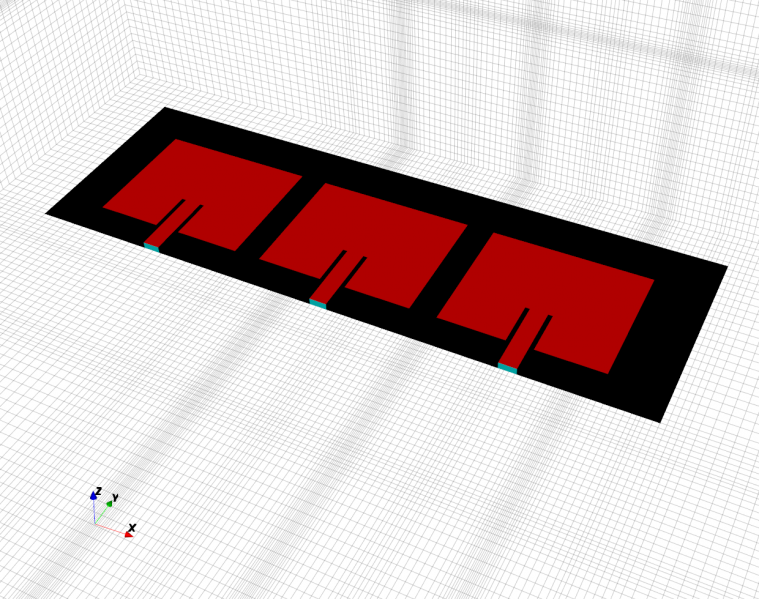
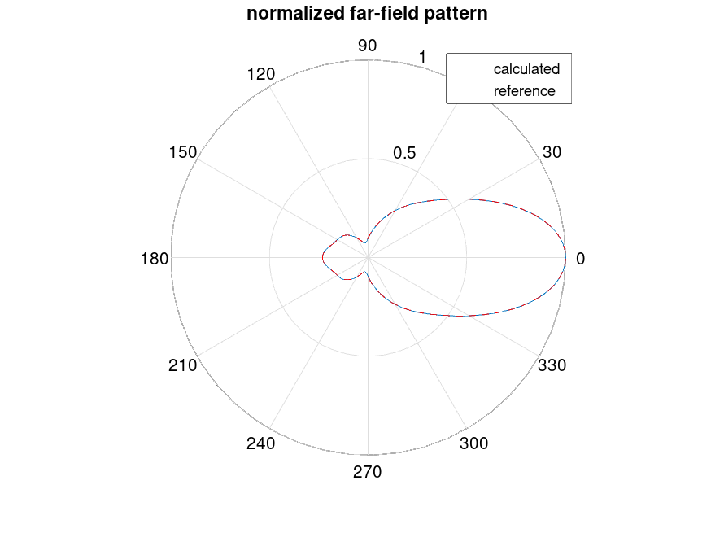
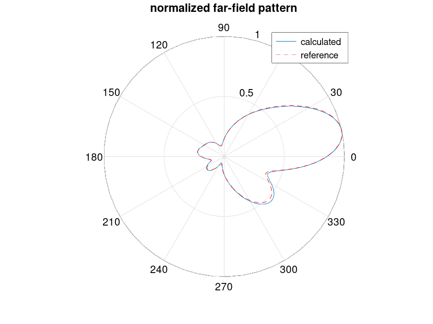
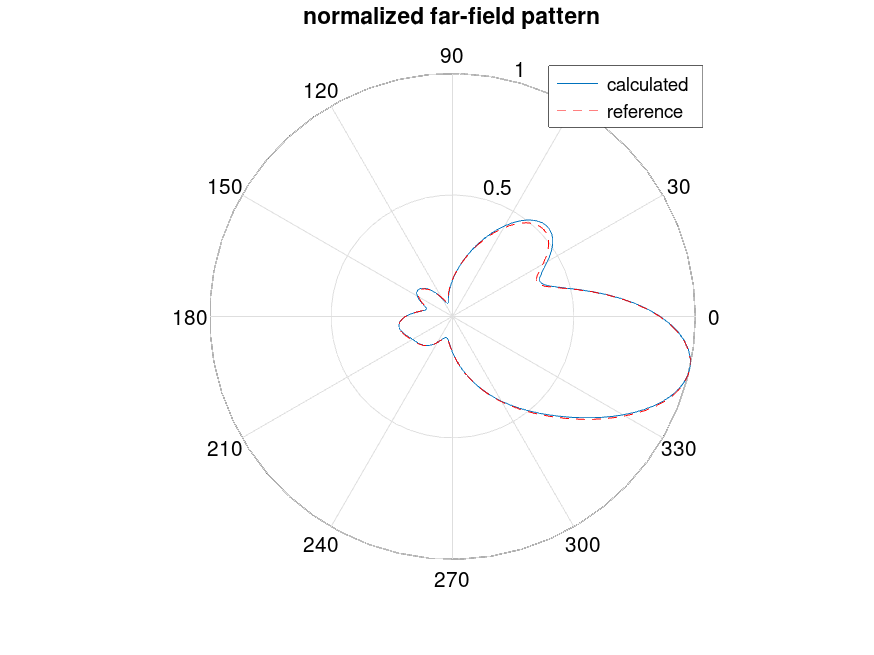

.. _octave_tutorial_patch_phased_array:

Patch Antenna Phased Array
===========================

Apply complex phase weights to a three-element patch array (helper function
``Patch_Antenna_Array``) to steer the beam and compute the steered radiation
pattern.

**This tutorial covers:**

* S-parameter-based beamforming using superposition
* Phase taper calculation for a target scan angle
* Steered far-field pattern vs. broadside comparison

Octave/Matlab Script
--------------------

.. include:: ./__Patch_Antenna_Phased_Array.txt

Array Element Helper Function
-----------------------------

The main script delegates the per-element simulation to
``Patch_Antenna_Array``, which sets up the single-element geometry and mesh,
activates the requested port, and returns the S-parameters and NF2FF result.
Running it once per port gives the full 3×3 S-matrix used for beamforming.

.. include:: ./__Patch_Antenna_Array.txt

Images
------

    Three-element patch array geometry (AppCSXCAD)

    Far-field pattern — C\ :sub:`2` = 0.2 pF, C\ :sub:`3` = 0.2 pF

    Far-field pattern — C\ :sub:`2` = 0.2 pF, C\ :sub:`3` = 1.0 pF

    Far-field pattern — C\ :sub:`2` = 1.0 pF, C\ :sub:`3` = 0.2 pF

Literature
----------

* Y. Yusuf and X. Gong, "A low-cost patch antenna phased array with analog beam
  steering using mutual coupling and reactive loading," *IEEE Antennas Wireless
  Propag. Lett.*, vol. 7, pp. 81–84, 2008.
* S. Otto, S. Held, A. Rennings, and K. Solbach, "Array and multiport antenna
  farfield simulation using EMPIRE, MATLAB and ADS," *39th European Microwave
  Conf. (EuMC 2009)*, Rome, Italy, pp. 1547–1550, Sept.–Oct. 2009.
* K. Karlsson, J. Carlsson, I. Belov, G. Nilsson, and P.-S. Kildal,
  "Optimization of antenna diversity gain by combining full-wave and circuit
  simulations," *2nd European Conf. on Antennas and Propagation (EuCAP 2007)*,
  Nov. 2007, pp. 1–5.
