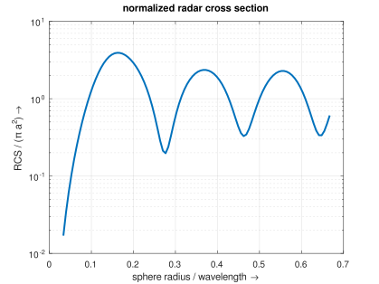

.. _octave_tutorial_rcs_sphere:

Metal Sphere Radar Cross Section
=================================

Compute the radar cross section (RCS) of a perfectly conducting metal sphere
using a total-field/scattered-field plane wave excitation and a near-field to
far-field transformation. **Simulation time: ~1 min.**

**This tutorial covers:**

* Total-field/scattered-field (TFSF) plane wave injection
* Setting up a near-field to far-field (NF2FF) surface
* Computing the bistatic RCS pattern at a single frequency
* Sweeping the frequency range to obtain the broadband monostatic RCS
* Normalizing the RCS to the sphere's geometric cross section for comparison with the Mie series solution

Octave/Matlab Script
--------------------

.. include:: ./__RCS_Sphere.txt

Images
------

    Normalized monostatic RCS (RCS / πa²) vs. sphere radius / wavelength — openEMS result compared against the analytical Mie series solution
