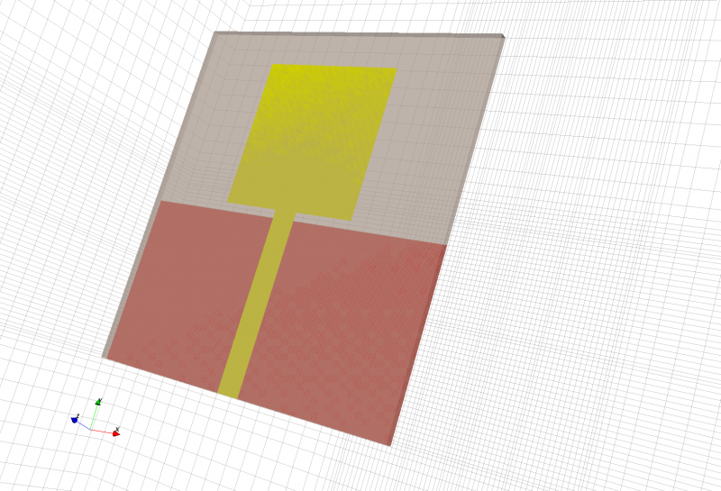
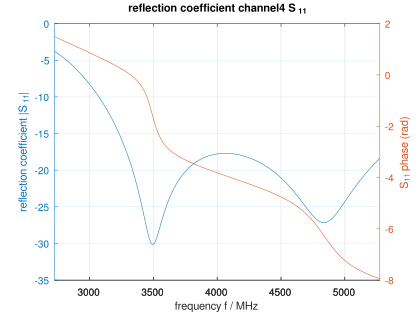
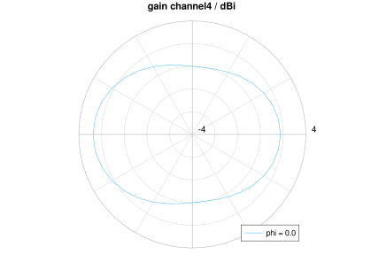
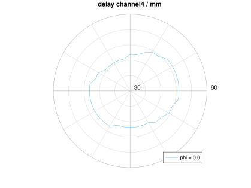
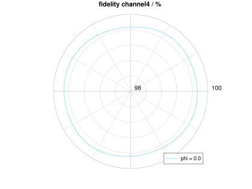

.. _octave_tutorial_uwb_radar:

UWB Radar — Delay and Fidelity
================================

Simulate a simple UWB monopole antenna across IEEE 802.15.4 channels and
compute delay and fidelity as figures of merit for time-domain pulse integrity.
**Simulation time: ~3 min.**

**This tutorial covers:**

* Channel-configurable Gaussian excitation matched to IEEE 802.15.4 UWB bandwidths (channels 1–5, 7)
* Advanced meshing: fine resolution near antenna structures, coarser resolution in free space, graded via ``SmoothMeshLines``
* :func:`DelayFidelity` for time-domain pulse characterization
* Polar plots of delay (mm) and fidelity (%) vs. angle
* Comparison across multiple UWB channels

Octave/Matlab Script
--------------------

.. include:: ./__RadarUWBTutorial.txt

Images
------

    UWB monopole antenna geometry (AppCSXCAD)

    Reflection coefficient \|S\ :sub:`11`\| and phase for UWB channel 4

    Gain (dBi) polar plot for UWB channel 4

    Delay (mm) polar plot for UWB channel 4

    Fidelity (%) polar plot for UWB channel 4
