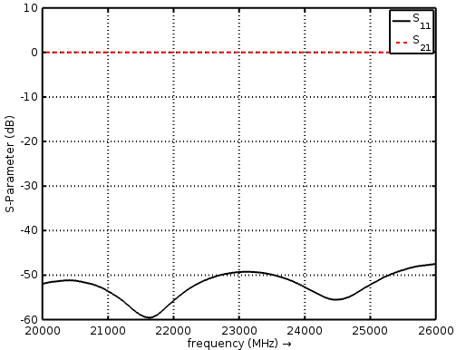
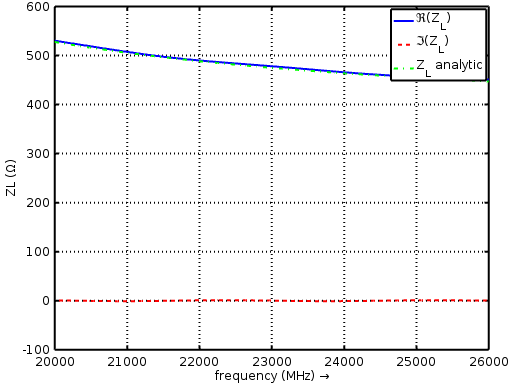
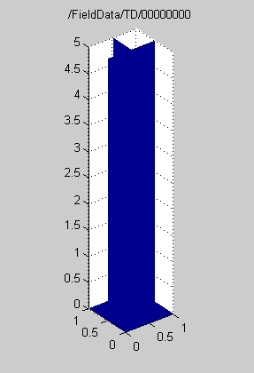

.. _octave_tutorial_rect_waveguide:

Rectangular Waveguide
=====================

Simulate a WR-42 rectangular waveguide using TE10 mode ports, then extract
and validate S-parameters and wave impedance against analytic values.

**This tutorial covers:**

* Setting up a TE10 mode excitation using ``AddRectWaveGuidePort``
* Applying PML boundary conditions to terminate the waveguide ends
* Extracting S-parameters and numerical wave impedance via ``calcPort``
* Comparing the simulated wave impedance against the analytic TE10 result
* Animating time-domain E-field data from an HDF5 field dump

Octave/Matlab Script
--------------------

.. include:: ./__Rect_Waveguide.txt

Images
------

    S-parameters of the rectangular waveguide

    Simulated wave impedance vs. analytic TE10 result

    Time-domain E-field animation of the propagating TE10 mode

Notes
-----

**Port field variable naming:** the ``calcPort`` output uses the following
convention throughout openEMS:

* ``uf`` / ``if`` — frequency-domain voltage / current spectra
* ``inc`` — incident wave component
* ``ref`` — reflected wave component
* ``tot`` — total (incident + reflected)
