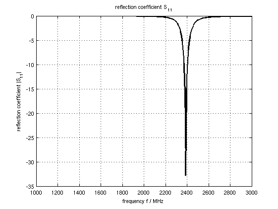
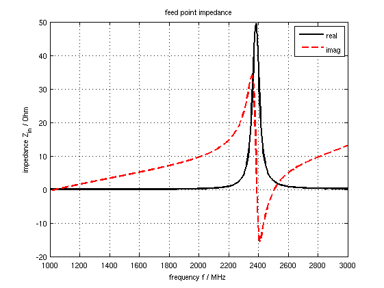
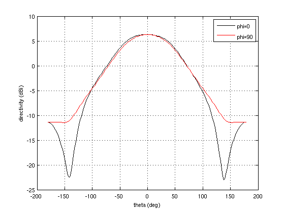

.. _octave_tutorial_simple_patch:

Simple Patch Antenna
====================

Simulate a rectangular microstrip patch antenna at 2.4 GHz, extract S11, compute
radiation patterns, and calculate gain and efficiency via near-field to far-field
transformation.

**This tutorial covers:**

* Patch antenna geometry and feed port setup
* Automatic mesh refinement with :func:`SmoothMesh`
* NF2FF box placement and far-field calculation with :func:`CalcNF2FF`
* Gain and efficiency extraction from port and far-field data

Octave/Matlab Script
--------------------

.. include:: ./__Simple_Patch_Antenna.txt

Images
------

    Reflection coefficient S11 over frequency

    Feed-point input impedance (real and imaginary)

    Farfield radiation pattern

Suggested Enhancements
-----------------------

* Apply the :ref:`1/3–2/3 mesh offset rule <octave_tutorial_msl_notchfilter>` to
  improve thin-metal edge accuracy (see the MSL Notch Filter tutorial for a
  detailed discussion).
* Extend to a phased patch array — see the
  :ref:`Patch Antenna Phased Array <octave_tutorial_patch_phased_array>` tutorial.
