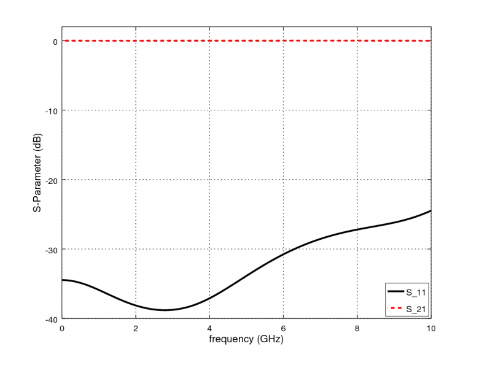

.. _octave_tutorial_stripline2msl:

Stripline to MSL Transition
============================

Simulate the transition between a balanced stripline and an unbalanced
microstrip line (MSL) and extract the S-parameters of the two-port transition.
**Simulation time: ~2 min.**

**This tutorial covers:**

* Stripline port setup (balanced, ground planes above and below)
* Microstrip line (MSL) port setup in the same simulation
* Transition via (cylinder) with a circular cutout in the ground plane
* Inhomogeneous mesh for improved accuracy and simulation speed: fine cells near the via gap, coarser cells elsewhere
* S-parameter extraction and insertion loss analysis

Octave/Matlab Script
--------------------

.. include:: ./__StripLine2MSL.txt

Images
------

    S-parameters (S11, S21) of the stripline to microstrip transition
